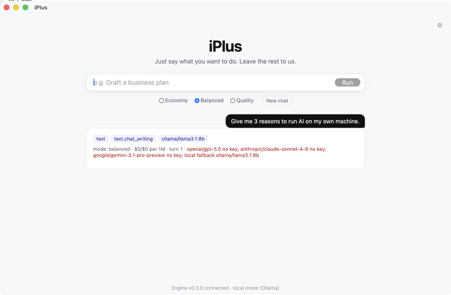
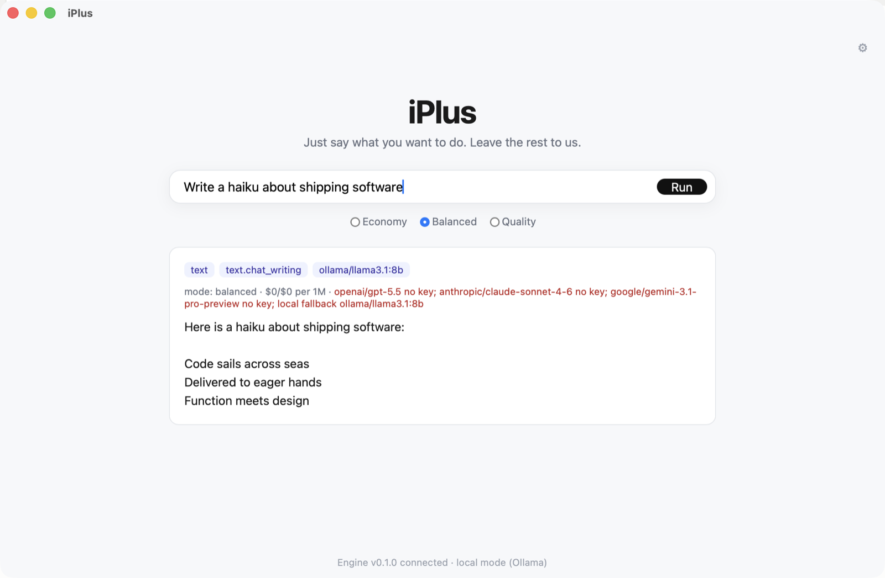

<div align="center">

# iPlus

**Say what you want to do — iPlus picks the right AI for you.**

[](https://github.com/yuneunmi814-cmyk/iplus/actions/workflows/test.yml)
[](https://github.com/yuneunmi814-cmyk/iplus/releases)
[](LICENSE)
[](#install)

An open-core AI orchestration desktop app. You describe your intent in one line;
iPlus judges intent, cost, quality, and modality, then **auto-dispatches** the best
model. You never need to know model names (GPT, Claude, Gemini, Sora…).

[**Quickstart**](#quickstart-5-minutes) · [Features](#features) · [How it works](#architecture) · [Build the app](#build-the-desktop-app) · [Roadmap](#status)

<br>



<sub>Type a request → iPlus classifies it, routes to a model, and <b>streams the answer</b> — free on a local model (Ollama), no API key.</sub>

<br><br>



<sub>…and it <b>remembers across turns</b> (SCB): turn 2 recalls what you said in turn 1.</sub>

</div>

---

## Quickstart (5 minutes)

Both paths give you a working AI that runs **free and 100% local — no API key required**.

### A · Just use it (no coding, ~3 min)

1. **Download** the installer for your OS from the **[latest release](../../releases/latest)**:
   - macOS (Apple Silicon): `iPlus_*_aarch64.dmg`
   - Windows: `iPlus_*_x64-setup.exe`
2. **Open it.** Builds are unsigned for now, so the first launch needs one click:
   - macOS: right-click the app → **Open** (bypasses Gatekeeper)
   - Windows: **More info → Run anyway** on the SmartScreen prompt
3. **Get a free local model** (recommended): install **[Ollama](https://ollama.com)**, then:
   ```bash
   ollama pull llama3.1:8b
   ```
   *(Or skip Ollama and paste your own OpenAI / Anthropic / Google key into the ⚙ settings.)*
4. **Ask anything.** Type a request and press **Run** — the answer streams in.
   The status bar should read `Engine v0.3.0 connected · local mode (Ollama)`.

### B · Run from source (developers, ~5 min)

**Prerequisites:** Python **3.12**, plus **[Ollama](https://ollama.com)** for free local answers.

```bash
# 1 · clone
git clone https://github.com/yuneunmi814-cmyk/iplus.git
cd iplus

# 2 · free local model (skip if you'll use your own API key instead)
ollama pull llama3.1:8b

# 3 · start the engine
cd engine
python3.12 -m venv .venv && source .venv/bin/activate
pip install -r requirements.txt
python -m app.main                  # serves http://localhost:8787

# 4 · open the UI (in a second terminal, from the repo root)
open frontend/dist/index.html       # macOS · Linux: xdg-open · Windows: start
```

You should see the iPlus window say **“Engine v0.3.0 connected.”** Type
*“write a haiku about the sea”* and watch it stream. Sanity-check the engine directly:

```bash
curl localhost:8787/health
# {"status":"ok","version":"0.3.0","keys":[]}
```

**Troubleshooting**
- Answer shows *“Cannot reach Ollama”* → run `ollama serve` in another terminal.
- UI says *“Engine not connected”* → make sure step 3 is still running on port 8787.
- `pydantic-core` build error → you're on Python 3.13/3.14; use **3.12** (`python3.12 -m venv`).

### Run the tests
```bash
cd engine && pip install -r requirements-dev.txt && python -m pytest   # 35 passing
```

## Why iPlus

Most AI tools make *you* do the hard part: pick the model, write the perfect prompt,
track the cost. iPlus absorbs that complexity. Poe says "you choose"; iPlus says "leave it to me."

**Hybrid open-core.** This repo (open source) is the **local tier**: the routing engine
runs on your machine, free, using local models (Ollama) or your own API keys (BYO).
A paid cloud tier adds managed keys, premium models, and team controls.

## Features
- **System picks the model, not you** — intent → model mapping, with eco / balanced / quality modes.
- **Cross-modality routing** — "turn this summary into an infographic" flows text → image in one step.
- **Automatic prompt engineering** — an intent-specific output contract is applied for you, so a one-line ask gets an expert-quality prompt.
- **Resale-aware catalog** — provider terms are enforced as a hard gate (see [the routing seed](docs/iplus_seed_routing.sql)).
- **100% local option** — run entirely on Ollama with no cloud calls, no keys.
- **Privacy-first** — append-only local SQLite; your data stays on your machine in the local tier.

## Architecture
```
┌──────────── Tauri desktop shell (Rust) ────────────┐
│  dist/index.html   one-line input UI                │
│        │ HTTP localhost:8787                         │
│  iplus-engine (sidecar) ── FastAPI routing engine   │
│        ├─ L0–L3 intent classification               │
│        ├─ mode (eco/balanced/quality) model select  │
│        ├─ resale-terms gate                          │
│        └─ local SQLite (append-only run log)         │
│  Ollama localhost:11434  (local models, optional)   │
└─────────────────────────────────────────────────────┘
```

| Path | What |
|---|---|
| `engine/` | Python FastAPI routing engine (heart of the local tier) |
| `engine/app/catalog.py` | Model catalog v1 seed (researched & verified, 2026-06) |
| `engine/app/router.py` | L0–L3 classification + mode-based routing |
| `frontend/src-tauri/` | Tauri shell — sidecar lifecycle, updater, signing |
| `frontend/dist/` | Static one-line-input UI (no Node build needed) |
| `docs/` | Routing seed (`routing_rules`) SQL |

## Build the desktop app

The [Quickstart](#quickstart-5-minutes) runs the engine from source. To build the
installable desktop app yourself, you also need **Rust** and **Node**:

```bash
# 0) install Rust once
curl --proto '=https' --tlsv1.2 -sSf https://sh.rustup.rs | sh

# 1) bundle the engine into a single binary → externalBin
cd engine && ./build.sh

# 2) generate the updater signing key once → put the pubkey in tauri.conf.json
cd ../frontend && npm install
npx tauri signer generate -w ~/.tauri/iplus.key

# 3) build the desktop app (.dmg / .app / .msi)
npm run build
```

## Release (GitHub Releases, Meetily-style)
`git tag v0.1.0 && git push --tags` triggers `.github/workflows/release.yml`, which builds,
signs, generates `latest.json`, and uploads installers for all platforms. Clients then
auto-update via `tauri-plugin-updater`.

Required GitHub Secret: `TAURI_SIGNING_PRIVATE_KEY` (mandatory),
`APPLE_*` (macOS notarization, optional — otherwise an ad-hoc build).

## Local engine API
| Method | Path | Description |
|---|---|---|
| GET | `/health` | status, version, detected keys |
| GET | `/catalog` | intents, modes, resale-blocked models |
| POST | `/classify` | input → intent classification only |
| POST | `/tasks` | input → classify → routing decision (+ run log) |

## Status
- [x] Local engine: L0–L3 classification + mode routing + resale gate + SQLite log (verified)
- [x] **Tauri shell + sidecar + signed updater + CI** — `.dmg` (20 MB) built & run-verified
- [x] **Sidecar auto-start / cleanup** — engine spawns & health-checks inside the app; a
      watchdog self-terminates the engine if the shell is force-killed (no orphans)
- [x] **Connector layer** — real streamed model calls over SSE: local Ollama (no key) +
      BYO OpenAI / Anthropic / Google; in-app key settings (stored locally)
- [x] **Conversation memory (SCB v1)** — multi-turn context retention; the history is
      replayed as messages, so context survives even a model/mode switch
- [x] **Intent Compiler v1** — an intent-specific output contract (system prompt) is
      applied for you and tuned by mode; the system does the prompt engineering
- [x] **SCB summarization** — turns beyond a recent window fold into a rolling summary,
      so long conversations keep their memory within a token budget
- [x] **Intent Compiler v2** — asks one high-leverage question only when a required slot is
      clearly missing (e.g. translation with no target language), then folds the answer back in
- [ ] Intent Compiler slot-filling from a user profile / history
- [ ] Image / audio / video generation (text generation works today)
- [ ] Cloud tier (subscription · KMS · teams)

### macOS packaging gotchas found by actually running the app (a review can't catch these)
1. **Hardened runtime vs PyInstaller library validation** — an ad-hoc-signed app with hardened
   runtime refuses to `dlopen` the `Python.framework` PyInstaller extracts to `/tmp`
   ("different Team IDs"). Fix: add `com.apple.security.cs.disable-library-validation` to
   `entitlements.plist`.
2. **PyInstaller `--onefile` defeats a naive parent-death watchdog** — it's a 2-process
   [bootloader → Python] tree, so Python's parent is the bootloader, not the shell. Fix: the
   shell passes its own PID via `--parent-pid` and the engine checks it with `os.kill(pid, 0)`.
3. **Cold start ~8–15 s** — `--onefile` self-extracts to `/tmp` on each launch; keep the health
   timeout generous (30 s).

## Tech
React-ready static UI · Tauri 2 (Rust) · FastAPI · SQLite (local) · PyInstaller sidecar ·
Ollama. Routing weights cite public benchmarks (Artificial Analysis, LMArena, Chatbot Arena).

## License
MIT — see [LICENSE](LICENSE).
